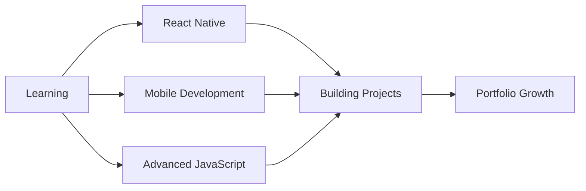

<div align="center">

# 👨‍💻 Dinuka Dilshan Samarasinghe

### `Computer Science Student • Full Stack Developer • Tech Enthusiast`


[](https://github.com/DinukaS2004)

</div>

---

## 🚀 About Me

```typescript
const dinuka = {
    location: "Sri Lanka 🇱🇰",
    education: "Computer Science Student",
    currentFocus: "React Native Development",
    interests: ["Web Development", "Mobile Apps", "UI/UX Design"],
    lifeGoal: "Gaining 10kg & Building Muscle 💪 (Started: June 2025)",
    askMeAbout: ["Web Dev", "JavaScript", "React", "Problem Solving"],
    funFact: "Code is poetry, and I'm writing an epic! ✨"
};
```

<div align="center">

### 📬 Let's Connect!

[](mailto:dinukad735@gmail.com)
[](https://www.linkedin.com/in/dinuka-samarasinghe-bb5958210)
[](https://www.facebook.com/profile.php?id=100073270812673)
[](https://www.instagram.com/_dinuka_s)

</div>

---

## 💻 Tech Stack

<div align="center">

### Languages


### Web Technologies


### Database & Tools


### Design


</div>

---

## 📊 GitHub Statistics

<div align="center">
  
  
</div>

<div align="center">
  
  
</div>

---

## 🏆 GitHub Trophies

<div align="center">
  
</div>

---

## 🎯 Current Focus

<div align="center">



</div>

---


---

## ☕ Support My Work

<div align="center">

If you like my work and want to support me, consider buying me a coffee! ☕

[](https://www.buymeacoffee.com/dinukaS)

</div>

---

<div align="center">

### 💭 Random Dev Quote


---


**⭐️ From [DinukaS2004](https://github.com/DinukaS2004) with 💙**

</div>
